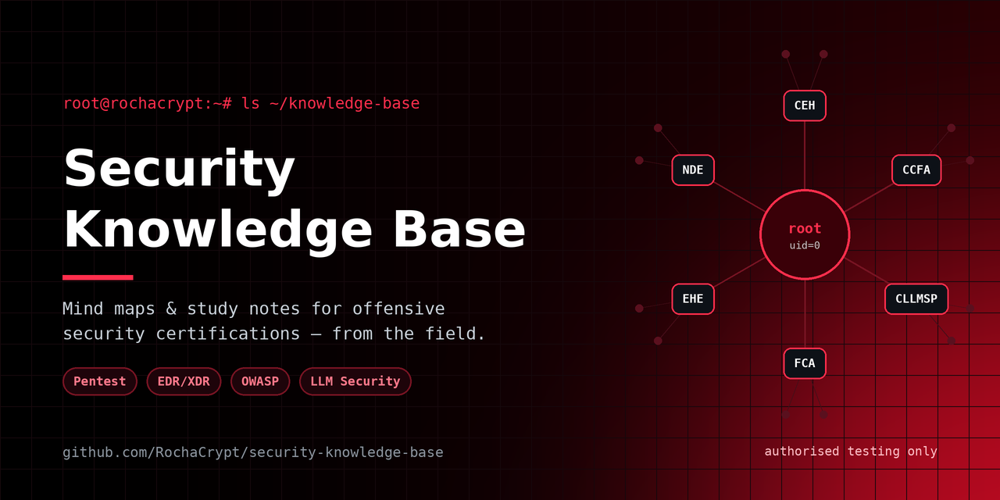

<div align="center">



# 🧰 Arsenal

<a href="https://github.com/RochaCrypt"></a>


</div>

```console
root@rochacrypt:~# ls ~/arsenal
recon/   reporting/   blue-team/   utils/
```

<div align="center">

### 🔗 [**Open the interactive catalog →**](https://rochacrypt.github.io/arsenal/)

<sub>112 tools · search & filter by category and track · works on mobile</sub>

</div>

A curated set of **operational security scripts and helpers** I use to speed up day-to-day work — recon organisation, reporting, blue-team triage and small utilities. Everything here is built for **defensive work and authorised testing only**.

## 📂 Categories

| Folder | What's inside |
| :--- | :--- |
| [`recon/`](./recon) | Scanning & enumeration helpers that organise output |
| [`reporting/`](./reporting) | Turn raw findings into clean deliverables |
| [`blue-team/`](./blue-team) | Read-only triage & log analysis for detection and IR |
| [`utils/`](./utils) | Small standalone security utilities |

## 🧩 Scripts

| Script | Language | Does |
| :--- | :--- | :--- |
| [`recon/nmap-quickscan.sh`](./recon/nmap-quickscan.sh) | Bash | Structured Nmap sweep → discovery, ports, services, saved per host |
| [`reporting/findings-to-report.py`](./reporting/findings-to-report.py) | Python | Findings JSON → sorted CSV + Markdown table |
| [`blue-team/ir-triage.ps1`](./blue-team/ir-triage.ps1) | PowerShell | Read-only Windows host snapshot for incident response |
| [`blue-team/auth-log-triage.py`](./blue-team/auth-log-triage.py) | Python | Summarise SSH auth logs: failed logins, top IPs & users |
| [`utils/password-policy-check.py`](./utils/password-policy-check.py) | Python | Validate passwords against a policy + estimate entropy |

## 🚀 Usage

Each script is self-contained with a header explaining purpose, requirements and usage. Examples:

```bash
# Recon (authorised targets only)
./recon/nmap-quickscan.sh 10.0.0.0/24

# Reporting
python3 reporting/findings-to-report.py findings.json -o report

# Blue team
python3 blue-team/auth-log-triage.py /var/log/auth.log

# Utils
python3 utils/password-policy-check.py --min-length 14
```

## ⚠️ Responsible use

> These tools are for **authorised security testing, defence and education only**. Only run them against systems you own or have **explicit written permission** to test. You are responsible for complying with all applicable laws and agreements. The author accepts no liability for misuse.

## 🌐 Live catalog (GitHub Pages)

The [`index.html`](./index.html) page is a **searchable, filterable catalog of 112 tools** across 13 categories. To publish it:

1. Go to **Settings → Pages**.
2. Under *Build and deployment*, set **Source: Deploy from a branch**.
3. Choose branch **main** and folder **/ (root)**, then **Save**.
4. After a minute it goes live at **https://rochacrypt.github.io/arsenal/**.

## 📜 License

MIT — see [`LICENSE`](./LICENSE). Contributions and suggestions welcome via issues and pull requests.

<div align="center">
<br/>
<a href="https://github.com/RochaCrypt"></a>
</div>
